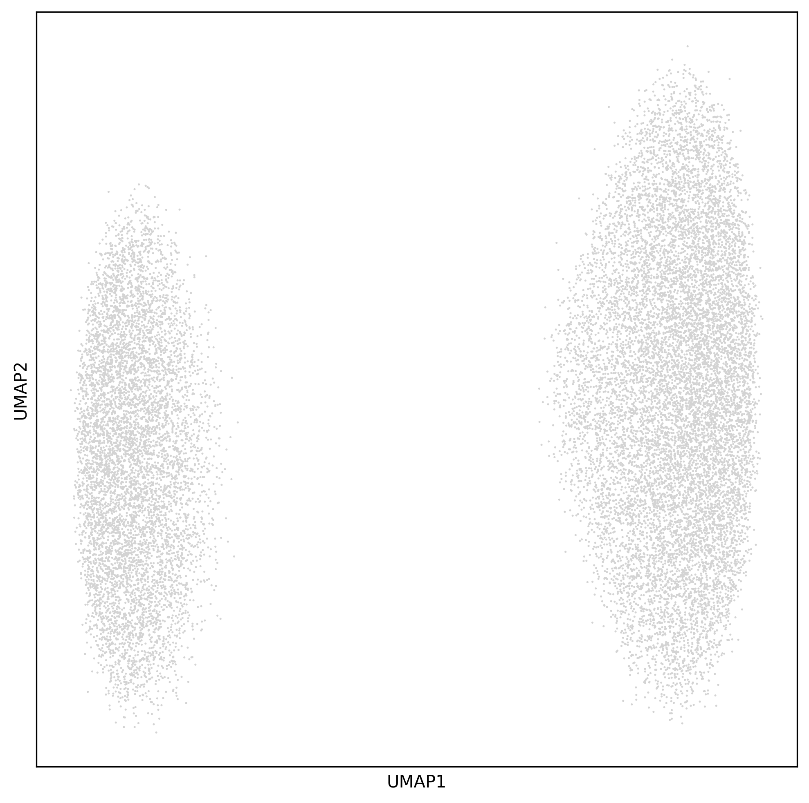

# Low-Abundance Transcript Simulation

This is a small simulated experiment to demonstrate
how low-abundance transcripts can induce fake neighborhoods
during clustering.

## Motivation

Imagine that a group of identical cells produce a transcript
with abundance equal to one per 20,000 (CPTT 0.5).
Then imagine that we run a single-cell experiment that captures
a mean of 10,000 transcripts per cell.

Roughly half of the cells in our experiment will produce 1
transcript on our target gene, and the other half will produce 0,
with a mean of roughly 0.5 and a standard deviation of roughly 0.5.

The cells with count=1 and count=0, despite being identical,
have expression levels of the target gene two standard deviations
apart (count=0, z=-1 and count=1,z=+1).

Note that this problem is specific to the abundance/capture rate
combination we've chosen here (abundance roughly one half of mean UMIs/cell).
For substantially lower capture rates, the abundance will be estimated at zero
for all cells, and for substantially higher capture rates, the number of
observed UMIs will tend towards the true abundance distribution among cells
in the target population.

In other words, we're predicting that the clustering in truly-homogenous
cell populations will be driven by transcripts with low but non-zero abundance.

# Simulation structure

The simulation code simulates a configurable number of cells (20,000),
genes (400), mean umis/cell (1200), and standard deviation in umis/cell (250).

UMIs are added to the matrix by first determining the number of output
UMIs from each cell (sampling randomly from the configured gaussian distribution),
then sampling UMIs by drawing from the pool of genes according to their relative weights.

All genes except for "low-abundance" genes are given the same weight.
Low-abundance genes are given a weight that is computed from the mean
output UMIs to deliver a mean number of output UMIs equal to one half (0.5).

Simulated data is output as a 10x-compatible MTX directory.

# Processing

The `main.py` script reads the simulation's MTX output and performs
a fairly standard single-cell preprocessing workflow:

 - UMI counts are log1p(CPTT)-normalized
 - PCA is performed on the normalized matrix
 - Neighbordhood analysis and UMAP projection are performed on the matrix
 - The UMAP projection is output to a png

# Results

As expected, inducing precisely one low-abundance gene creates two
clear clusters in the UMAP output:

With 20,000 cells, 1200+/-250 UMIs/cell, 400 genes, 1 low-expression gene:

If we add a second low-abundance gene and hold the other parameters constant,
we should expect one cluster per `(present,absent)` tuple per gene, so four clusters,
which is what we get:

# Discussion

Quantization error induces variance in low-abundance genes,
which fools linear statistical tools like PCA and UMAP into
discovering fake clustering neighborhoods.

For a given experiment, it may be possible to *deliberately*
induce clustering on a given gene by selecting a particular
chemistry capture rate (UMIs/cell).

The fundamental mathematical issue here is that PCA is designed
to find axes of high variance, but the *measured* variance of low-abundance
transcripts is actually higher than the *true* variance by a substantial margin,
while the variance of high-abundance transcripts is measured much more accurately.
(This effect is further amplified by the conventional log-scaling transformation
performed on raw transcript counts.)

